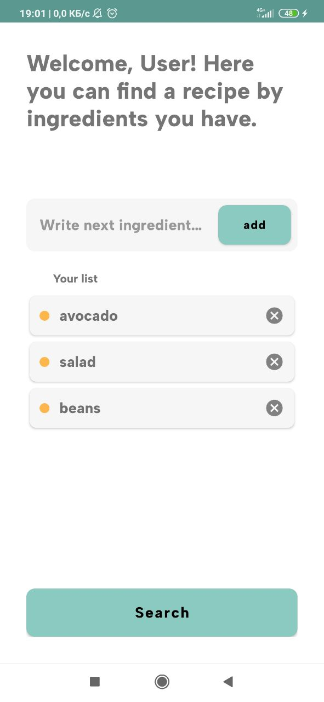
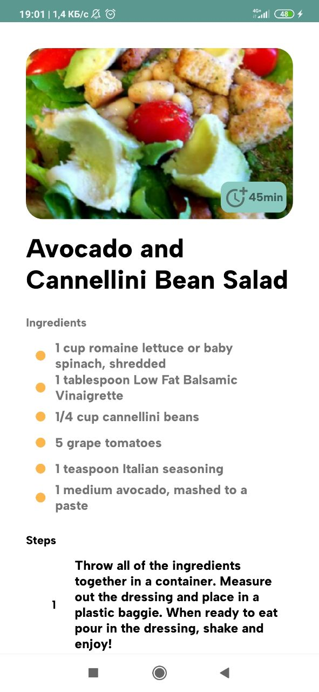

# Recipe Offer Project
Учебный проект, в котором я использую базовый функционал Android и учусь применять его основные компоненты. Представляет собой приложение для подбора рецепта по имеющимся ингридиентам. На первом экране пользователь вводит продукты, они отображаются в списке, и далее по нажатию на кнопку поиск открывается экран с деталями найденного рецепта.

## API
Поиск рецепта осуществляется с помощью открытого API Spoonacular, предоставляющего множество запросов по получению детальной информации о рецептах, продуктах, их пищевой ценности и др. API также содержит метод подбора рецепта по ингридиентам, которые частично присутствуют в рецептах, и на основе этого выбирает наиболее подходящий результат. Авторизация запросов проходит по выданному API ключу.

[Подробнее об API](https://spoonacular.com/food-api/docs#Search-Recipes-by-Ingredients)

## Стек технологий
* Kotlin
* Fragments, FragmentManager
* Room
* Retrofit
* ViewModel, LiveData

## Архитектура
В качестве архитектуры использовалась архитектура MVVM. Приложение разделено на 3 подуровня.
* Представление - Activity, Фрагменты, Адаптеры для RecyclerView
* Модель представления - связывает данные с помощью подписок на LiveData
* Модель - репозитории, которые контролируют источники получения данных. В этом приложении - данные приходят из сети и извлекаются из локальной базы данных.

## Фото интерфейса (рабочее состояние)

  
  

  

Созданный интерфейс для входа в аккаунт (пока без программной реализации)  

## Статус
В процессе добавления новых функций
* сохранение результата сетевого запроса в локальную базу данных
* добавление найденных рецептов во вкладку Отложенные
* добавление аутентификации пользователей, используя Firebase

